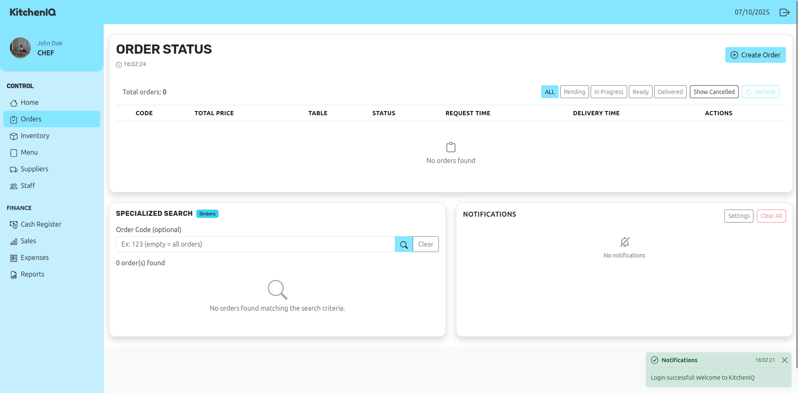

# Kitchen IQ

KitchenIQ is a back-office system designed for small and medium-sized restaurants that want to optimize their internal operations by digitizing and automating key processes. The platform enables management of inventory, suppliers, finances, staff, orders, and data analysis, ensuring efficient and profitable administration.

## Table of Contents
- [Introduction](#introduction)
- [Project Examples](#project-examples)
- [Key Features](#key-features)
- [Project Structure](#project-structure)
- [Prerequisites](#prerequisites)
- [Installation](#installation)
- [Run and Development](#run-and-development)
- [Build and Deployment](#build-and-deployment)
- [Build Details (technologies, architecture, libraries, APIs)](#build-details-technologies-architecture-libraries-apis)
- [Key Code Snippets](#key-code-snippets)
- [API Configuration (backend)](#api-configuration-backend)
- [Useful Resources](#useful-resources)
- [Contributors](#contributors)

## Introduction
KitchenIQ provides a modern UI built with React + Vite and a responsive design powered by Bootstrap. It integrates token-based authentication, role-aware routing (employee/supplier), centralized notifications (toasts), and consumption of multiple API domains for orders, inventory, and suppliers.

## Project Examples

### Login Screen
   

The login screen displays the KitchenIQ logo, a form for entering username and password, and a "Sign In" button.

### Suppliers Screen
   

The suppliers screen features a sidebar on the left with navigation buttons for Home, Orders, Inventory, Menu, Suppliers (current), and Staff. The Finance section includes Cash Register, Sales, Expenses, and Reports. At the top left, the logo, user role, profile image, and name are shown. The main area displays a table of supplier orders with their statuses, a notification modal, and a specialized search modal.

### Supplier Order PDF
   

This image shows the generated PDF for a delivered supplier order, including its summary and invoice.

### Specialized Supplier Search
   

A close-up of the specialized search in the suppliers section, with fields for filtering by Order ID, Status, Request Day, and Total Amount, plus a "Search" button.

### Chef Login and Orders Table
   

A login with a different user (role: chef) is shown, as indicated in the sidebar. The main area displays a table of restaurant orders, a button to create a new order, a specialized search modal, and a notifications modal.

### Create New Order Modal
   

The modal for creating a new order includes fields for Table Number, Quick Add for combos, a dropdown to select products or combos (e.g., Hamburger, French Fries, Drink), a notes section, and a summary on the right with items, subtotal, total, and buttons to cancel or create the order.

### Notifications Section
   

This section shows notifications and allows configuration of the notification interval.

### Inventory Section (Chef)
   

The inventory section, accessible to the chef user (note: suppliers only have access to the Suppliers section), displays a table with ID, Name, Description, Category, Base Quantity, and Stock Quantity for inventory items (e.g., tomato, bread, rice). There is also a button to create an inventory order, a specialized search section, and an empty notifications area.

### Create Inventory Item Modal
   

The modal for creating a new inventory item includes fields for name, description, category, base quantity, and stock quantity, as well as "Cancel" and "Create Inventory Item" buttons.

---

**Note:** The complete frontend project is not yet hosted on a public server. Once it is deployed, the cloud URL to access the project will be provided here: [Access KitchenIQ Frontend](URL_PLACEHOLDER_HERE).

## Key Features
Based on the current implementation in this repository:
- JWT-based Authentication
  - Login form with credential submission and token persistence in localStorage.
  - Fetching authenticated user info and normalizing user type/role.
  - Automatic session expiration handling (401) with redirect to log in page.
- Routing and Layout with Role Control
  - React Router with a main layout (TopNavbar + Sidebar) and route-based content.
  - Conditional redirection and navigation for SUPPLIER users.
- Orders Management
  - Create, update, fetch by status, and delete orders via API.
  - Normalization of backend statuses into frontend-supported ones (PENDING, IN_PROGRESS, READY, DELIVERED, CANCELLED).
- Inventory and Suppliers
  - Inventory CRUD and supplier order flow (initiate dispatch, deliver items, finish dispatch).
  - Download/view supplier purchase order PDFs in a new tab.
- Notifications (Toasts)
  - Context provider for toasts with levels: success, danger, warning, info.
  - Auto-dismiss with configurable duration.
- Responsive UI
  - Styling and components using Bootstrap 5 and React-Bootstrap; icons via Bootstrap Icons and Lucide.

## Project Structure
Root and relevant directories:
- vite.config.ts: Vite configuration.
- package.json: scripts, dependencies, and devDependencies.
- src/
  - main.tsx: entry point; mounts App and applies global styles.
  - App.tsx: providers (Auth and Toast), Router, and main layout.
  - service/api.ts: Axios clients, interceptors, models, and API functions.
  - components/
    - Auth/Login.tsx: authentication screen.
    - common/: Sidebar, TopNavbar, ToastContainer.
    - hooks/useToast.ts: hook for toast context.
    - InventoryStatus/, OrderStatus/, SupplierStatus/: domain-specific UI.
  - context/ToastContext.tsx, context/toastContext.ts: toast definitions and provider.
  - views/: Inventory.tsx, Order.tsx, Supplier.tsx.

## Prerequisites
- Node.js 18+ recommended.
- npm (or pnpm/yarn if you prefer; scripts are defined for npm).
- Backend running at http://localhost:5000 exposing the following API domains:
  - /kitcheniq/api/v1/auth, /kitcheniq/api/v1/users, /kitcheniq/api/v1/orders
  - /inventory, /supplier and /kitcheniq/api/v1/suppliers

## Installation

1) **Install Node.js and npm**  
Download and install Node.js from the official website:
[https://nodejs.org/](https://nodejs.org/)  
Recommended version: 18 or higher (LTS).

2) **Clone the repository**  
```bash
git clone https://github.com/MateoBermudez/kitcheniq-ui.git
cd kitcheniq-ui
```

3) Install dependencies:
```bash
npm install
```
4) (Optional) Verify the backend is running on http://localhost:5000.
> **Note:** For the backend and frontend to work correctly together, make sure the frontend runs on port `5173`. If you are using Vite, this is the default port.


## Run and Development
- Development mode (Vite dev server):
```bash
npm run dev
```

- Linter:
```bash
npm run lint
```

- Build preview (after compiling):
```bash
npm run preview
```

## Build and Deployment
- Build for production:
```bash
npm run build
```
This runs TypeScript (tsc -b) and the Vite build, generating optimized artifacts in dist/.

## Build Details (technologies, architecture, libraries, APIs)
- Framework and Tooling
  - React 19 with TypeScript
  - Vite 4 (with @vitejs/plugin-react)
  - SPA modular architecture using Context API (Auth, Toast) and React Router
- UI and Styles
  - Bootstrap 5, React-Bootstrap, Bootstrap Icons, Lucide React
  - SCSS (sass)
- Quality and DX
  - ESLint 9, Typescript-ESLint, modern configuration with @eslint/js
- Routing and State
  - react-router-dom 7 for protected routes and role-based redirects
  - Context API for auth and toasts; custom hooks (useToast)
- API Consumption (Axios + Fetch)
  - Two Axios clients:
    - UI/Inventory/Suppliers base: http://localhost:5000
    - Orders/Auth/Users base: http://localhost:5000/kitcheniq/api/v1
  - Request interceptors to attach Authorization: Bearer <token> and response interceptors to handle 401.
  - Login.tsx uses fetch for /auth/login (compatibility with current backend) and then sets the token for Axios.

## Key Code Snippets
- Axios interceptors and expiration handling (src/service/api.ts):
```ts
const apiClient = axios.create({ baseURL: 'http://localhost:5000', headers: { 'Content-Type': 'application/json' }});
const ordersApiClient = axios.create({ baseURL: 'http://localhost:5000/kitcheniq/api/v1', headers: { 'Content-Type': 'application/json' }});

apiClient.interceptors.request.use((config) => {
  const token = getAuthToken();
  if (token) config.headers.Authorization = `Bearer ${token}`;
  return config;
});

ordersApiClient.interceptors.request.use((config) => {
  const token = getAuthToken();
  if (token) config.headers.Authorization = `Bearer ${token}`;
  return config;
});

const handleAuthError = (error: unknown) => {
  if (axios.isAxiosError(error) && error.response?.status === 401) {
    removeAuthToken();
    window.dispatchEvent(new CustomEvent('auth-expired'));
  }
  return Promise.reject(error);
};

apiClient.interceptors.response.use((r) => r, handleAuthError);
ordersApiClient.interceptors.response.use((r) => r, handleAuthError);
```

- Authentication provider with persistence and role normalization (excerpt from src/App.tsx):
```tsx
const AuthContext = createContext<AuthContextType | null>(null);

function AuthProvider({ children }: { children: ReactNode }) {
  const [token, setToken] = useState<string | null>(null);
  const [user, setUser] = useState<User | null>(null);
  const [isLoading, setIsLoading] = useState(true);

  useEffect(() => {
    const storedToken = localStorage.getItem('authToken');
    const storedUserData = localStorage.getItem('userData');
    if (storedToken) {
      setToken(storedToken);
      const userData = storedUserData ? JSON.parse(storedUserData) : {};
      setUser({ id: userData.id || 'current_user', name: userData.name, type: userData.type?.toUpperCase() });
    }
    setIsLoading(false);
  }, []);

  const login = (newToken: string, userData?: { name?: string; type?: string; id?: string }) => {
    setToken(newToken);
    localStorage.setItem('authToken', newToken);
    const normalizedType = userData?.type?.toUpperCase();
    setUser({ id: userData?.id || 'current_user', name: userData?.name, type: normalizedType });
    if (userData) localStorage.setItem('userData', JSON.stringify({ ...userData, type: normalizedType }));
  };

  const logout = () => {
    setToken(null);
    setUser(null);
    localStorage.removeItem('authToken');
    localStorage.removeItem('userData');
  };

  return (
    <AuthContext.Provider value={{ user, token, login, logout, isAuthenticated: !!token && !!user, isLoading }}>
      {children}
    </AuthContext.Provider>
  );
}
```

- Routing with layout and role control (excerpt from src/App.tsx):
```tsx
function App() {
  return (
    <AuthProvider>
      <ToastProvider>
        <BrowserRouter>
          <AppContent />
        </BrowserRouter>
      </ToastProvider>
    </AuthProvider>
  );
}

function AppContent() {
  const { isAuthenticated, user } = useAuth();
  const navigate = useNavigate();
  const isSupplier = user?.type === 'SUPPLIER';

  useEffect(() => {
    if (!isAuthenticated) return;
    if (isSupplier) navigate('/supplier', { replace: true });
    else if (location.pathname === '/' || location.pathname === '/login') navigate('/orders', { replace: true });
  }, [isAuthenticated, isSupplier]);

  return isAuthenticated ? <MainLayout /> : <Login onLoginSuccess={() => {}} />;
}
```

- Reusable toasts (excerpt from src/context/ToastContext.tsx and usage):
```tsx
export const ToastProvider = ({ children }: { children: ReactNode }) => {
  const [toasts, setToasts] = useState<Toast[]>([]);
  const addToast = (messageOrObject: string | Partial<Toast>, type = 'info', duration = 5000): number => { /* ... */ };
  const showSuccess = (m: string | Partial<Toast>) => addToast(typeof m === 'object' ? { ...m, type: 'success' } : m, 'success');
  const showError = (m: string | Partial<Toast>) => addToast(typeof m === 'object' ? { ...m, type: 'danger' } : m, 'danger');
  // warning, info...
  return <ToastContext.Provider value={{ toasts, removeToast, showSuccess, showError, showWarning, showInfo }}>{children}</ToastContext.Provider>;
};

// Usage example (src/views/Inventory.tsx)
const { showSuccess, showError, showWarning, showInfo } = useToast();
```

- Orders API consumption (simplified excerpt from src/service/api.ts):
```ts
export const createOrder = async (orderData: OrderData) => {
  const firstComponent = orderData.components[0];
  const createDTO = { employeeId: orderData.requestingClient || 'Customer', menuComponentId: firstComponent.id, quantity: 1, tableNumber: parseInt(orderData.table, 10) || 0 };
  const response = await ordersApiClient.post<OrderResponseDTO>('/order', createDTO);
  // If there are more items, they are added afterward to /order/{id}/items
  return { /* map to frontend structure */ };
};
```

- Supplier PDF download/viewing:
```ts
export async function getSupplierOrderPdf(orderId: number): Promise<void> {
  const response = await apiClient.get('/kitcheniq/api/v1/suppliers/get-order-pdf', { params: { orderId }, responseType: 'blob' });
  const pdfUrl = URL.createObjectURL(new Blob([response.data], { type: 'application/pdf' }));
  window.open(pdfUrl, '_blank');
}
```

## API Configuration (backend)
By default, the clients are configured to:
- Base API (inventory/suppliers): http://localhost:5000
- Orders/Auth/Users API: http://localhost:5000/kitcheniq/api/v1

Key endpoints used:
- Auth: POST /kitcheniq/api/v1/auth/login
- Current user: GET /kitcheniq/api/v1/users/my-info?userId={id}
- Orders: GET /kitcheniq/api/v1/orders, GET /kitcheniq/api/v1/order/{id}, POST /kitcheniq/api/v1/order, PUT /kitcheniq/api/v1/order/{id}, DELETE /kitcheniq/api/v1/order/{id}
- Change status: PUT /kitcheniq/api/v1/order/{id}/status?status=READY|DELIVERED|...
- Inventory: POST /inventory/create, GET /inventory/getAll
- Suppliers: POST /kitcheniq/api/v1/suppliers/purchase-order, POST /kitcheniq/api/v1/suppliers/deliver-order, POST /kitcheniq/api/v1/suppliers/finish-dispatch, GET /kitcheniq/api/v1/suppliers/get-order-pdf

Note: URLs are currently defined in src/service/api.ts and the login endpoint in src/components/Auth/Login.tsx. For different environments, update these values or consider moving them to Vite environment variables (.env).

## Useful Resources
- React: https://react.dev
- Vite: https://vite.dev/guide
- React Router (v7): https://reactrouter.com
- TypeScript: https://www.typescriptlang.org/docs/
- Axios: https://axios-http.com/docs/intro
- Bootstrap 5: https://getbootstrap.com/docs/5.3/getting-started/introduction/
- React-Bootstrap: https://react-bootstrap.netlify.app/
- Bootstrap Icons: https://icons.getbootstrap.com/
- Lucide React: https://lucide.dev/icons
- ESLint: https://eslint.org/docs/latest/

## Contributors
- [Daniel Cardona](https://github.com/Umbrabilis)
- [Mateo Bermúdez](https://github.com/MateoBermudez)
- [Emmanuel Arango](https://github.com/EmmanuelArangoV)
- [Daniela García](https://github.com/Danieloid3)

